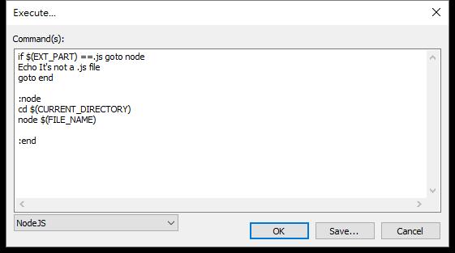
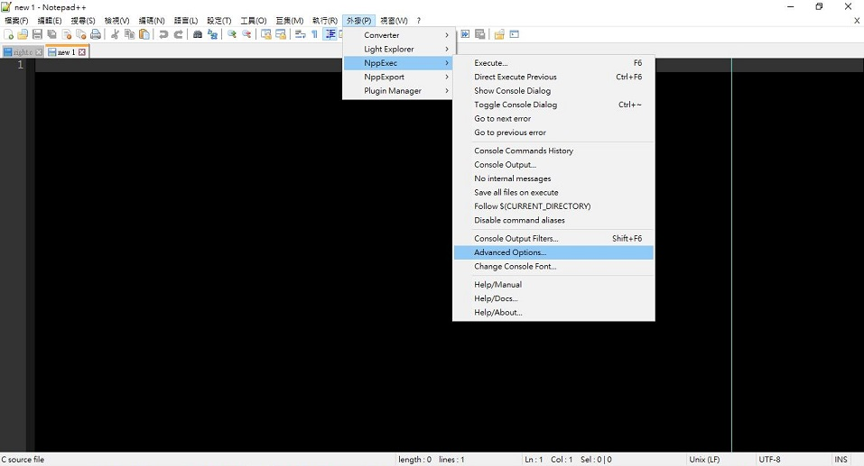
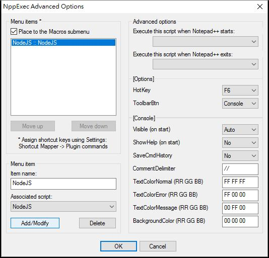
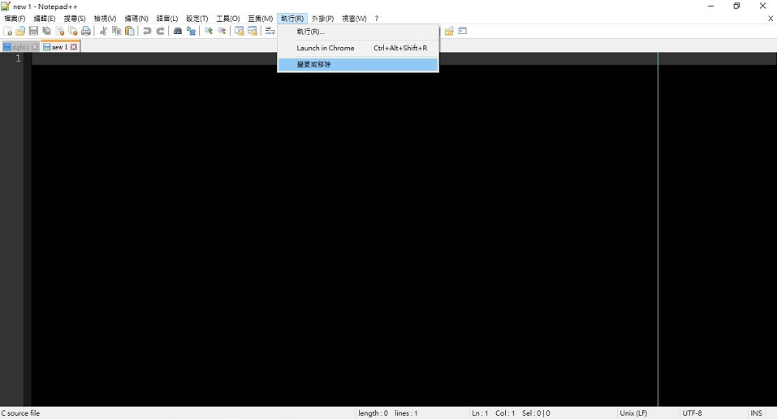
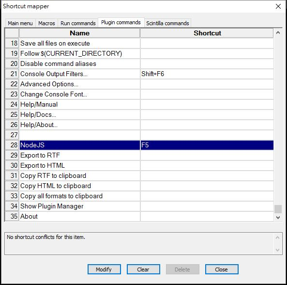

Notepad++
===


### ctrl+f -> 規則運算式(E) -> 尋找內容
```
\[[0-9]*-[0-9]*-[0-9]*\s+[0-9]*:[0-9]*:[0-9]*]\s+[\s+[0-9]*.[0-9]*]\R
```
---

### Plugin: NppExec

##### Execute


##### Execute: Node.js
```
if $(EXT_PART) ==.js goto node
Echo It's not a .js file
goto end

:node
cd $(CURRENT_DIRECTORY)
node $(FILE_NAME)

:end
```
##### Execute: Python
```
python "$(FULL_CURRENT_PATH)"
```
##### Execute: Robot Framework
```
robot --dotted -T "$(FULL_CURRENT_PATH)"
```
##### Execute: gcc
```
cd $(CURRENT_DIRECTORY)
gcc -Wall -O3 -o $(NAME_PART).exe $(FILE_NAME) -DDEBUG=1 -g3
$(NAME_PART).exe
cmd /c del "$(NAME_PART).exe"
```
##### Advanced Options -> Add Macros submenu -> Adjust 'Shortcut Mapper'





---

### User Define Language: Go
```
1. copy 'go.xml' into 'plugins\APIs'(C:\Program Files (x86)\Notepad++\plugins\APIs)
2. copy 'userDefineLang.xml' into '%APPDATA%/Notepad++'(C:\Users\user\AppData\Roaming\Notepad++)
	<NotepadPlus></NotepadPlus>
3. Restart Notepad++
```
---
